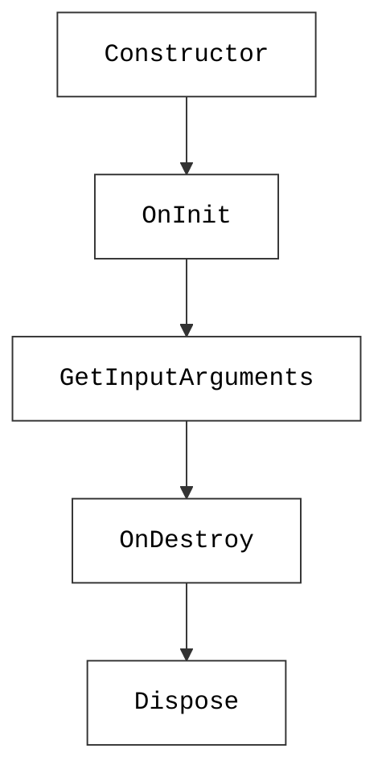
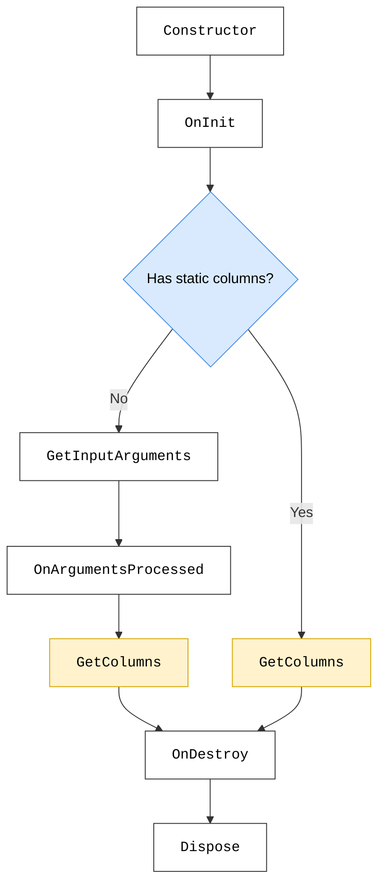

# Lifecycle of ad hoc data sources

Whenever an ad hoc data source is used, an instance of the associated C# class is created, and GQI calls the [lifecycle methods](#lifecycle-methods) that are needed for the current query phase.

## When is an ad hoc data source instance created?

A new ad hoc data source instance is created **every time** GQI starts one of the following query phases:

- **[Argument discovery](#argument-discovery-lifecycle)**: Determines which query arguments can be configured for the ad hoc data source.
- **[Column resolution](#column-resolution-lifecycle)**: Determines which columns are available without fetching any data.
- **[Query execution](#query-execution-lifecycle)**: Retrieves the actual data from the ad hoc data source.

The diagrams below give an overview of the ad hoc data source lifecycle in every query phase. Lifecycle methods are visualized in boxes with required methods colored yellow and lifecycle conditions are visualized in blue diamonds. Click on the methods and conditions to get more details.

### Argument discovery lifecycle

### Column resolution lifecycle

### Query execution lifecycle

```mermaid
flowchart TD
    Constructor[Constructor]
    OnInit[OnInit]
    HasStaticColumns{Has static columns?}
    GetInputArgumentsDynamic[GetInputArguments]
    OnArgumentsProcessedDynamic[OnArgumentsProcessed]
    GetColumnsDynamic[GetColumns]
    GetColumnsStatic[GetColumns]
    GetInputArgumentsStatic[GetInputArguments]
    OnArgumentsProcessedStatic[OnArgumentsProcessed]
    HasNextOperator{Has next operator?}
    Optimize[Optimize]
    OnPrepareFetch[OnPrepareFetch]
    UpdatesEnabledStart{Updates enabled?}
    OnStartUpdates[OnStartUpdates]
    MoreRowsRequested{More rows requested?}
    GetNextPage[GetNextPage]
    HasNextPage{Has next page?}
    UpdatesEnabledStop{Updates enabled?}
    OnStopUpdates[OnStopUpdates]
    OnDestroy[OnDestroy]
    Dispose[Dispose]

    Constructor --> OnInit
    OnInit --> HasStaticColumns
    HasStaticColumns -- No --> GetInputArgumentsDynamic
    GetInputArgumentsDynamic --> OnArgumentsProcessedDynamic
    OnArgumentsProcessedDynamic --> GetColumnsDynamic
    GetColumnsDynamic --> HasNextOperator
    HasStaticColumns -- Yes --> GetColumnsStatic
    GetColumnsStatic --> GetInputArgumentsStatic
    GetInputArgumentsStatic --> OnArgumentsProcessedStatic
    OnArgumentsProcessedStatic --> HasNextOperator
    HasNextOperator -- Yes --> Optimize
    Optimize --> HasNextOperator
    HasNextOperator -- No --> OnPrepareFetch
    OnPrepareFetch --> UpdatesEnabledStart
    UpdatesEnabledStart -- Yes --> OnStartUpdates
    UpdatesEnabledStart -- No --> GetNextPage
    OnStartUpdates --> GetNextPage
    GetNextPage --> HasNextPage
    HasNextPage -- Yes --> MoreRowsRequested
    HasNextPage -- No --> UpdatesEnabledStop
    MoreRowsRequested -- Yes --> GetNextPage
    MoreRowsRequested -- No --> UpdatesEnabledStop
    UpdatesEnabledStop -- Yes --> OnStopUpdates
    UpdatesEnabledStop -- No --> OnDestroy
    OnStopUpdates --> OnDestroy
    OnDestroy --> Dispose

    classDef optional fill:#ffffff,stroke:#333333,color:#000000,font-family:monospace;
    classDef required fill:#fff2cc,stroke:#d6a800,color:#000000,font-family:monospace;
    classDef condition fill:#d9eaff,stroke:#4a90e2,color:#000000;

    class Constructor,OnInit,GetInputArgumentsDynamic,GetInputArgumentsStatic,OnArgumentsProcessedDynamic,OnArgumentsProcessedStatic,Optimize,OnPrepareFetch,OnStartUpdates,OnStopUpdates,OnDestroy,Dispose optional;
    class GetColumnsDynamic,GetColumnsStatic,GetNextPage required;
    class HasStaticColumns,HasNextOperator,UpdatesEnabledStart,MoreRowsRequested,HasNextPage,UpdatesEnabledStop condition;

    click Constructor "#constructor" "Go to Constructor"
    click OnInit "#oninit" "Go to OnInit"
    click GetInputArgumentsDynamic "#getinputarguments" "Go to GetInputArguments"
    click GetInputArgumentsStatic "#getinputarguments" "Go to GetInputArguments"
    click OnArgumentsProcessedDynamic "#onargumentsprocessed" "Go to OnArgumentsProcessed"
    click OnArgumentsProcessedStatic "#onargumentsprocessed" "Go to OnArgumentsProcessed"
    click GetColumnsDynamic "#getcolumns" "Go to GetColumns"
    click GetColumnsStatic "#getcolumns" "Go to GetColumns"
    click HasStaticColumns "#does-the-data-source-have-static-columns" "Go to static columns condition"
    click HasNextOperator "#are-there-operators-to-optimize" "Go to operators condition"
    click UpdatesEnabledStart "#are-updates-enabled" "Go to updates condition"
    click MoreRowsRequested "#are-more-rows-needed" "Go to row request condition"
    click HasNextPage "#are-more-rows-available" "Go to page availability condition"
    click UpdatesEnabledStop "#are-updates-enabled" "Go to updates condition"
    click Optimize "#optimize" "Go to Optimize"
    click OnPrepareFetch "#onpreparefetch" "Go to OnPrepareFetch"
    click OnStartUpdates "#onstartupdates" "Go to OnStartUpdates"
    click GetNextPage "#getnextpage" "Go to GetNextPage"
    click OnStopUpdates "#onstopupdates" "Go to OnStopUpdates"
    click OnDestroy "#ondestroy" "Go to OnDestroy"
    click Dispose "#dispose" "Go to Dispose"
```

## Lifecycle methods

The following lifecycle methods exist for ad hoc data sources:

| Method | Interface | Required | Availability |
|--|--|--|--|
| [Constructor](#constructor) | None | No | Always |
| [OnInit](#oninit) | [IGQIOnInit](xref:GQI_IGQIOnInit) | No | Always |
| [GetInputArguments](#getinputarguments) | [IGQIInputArguments](xref:GQI_IGQIInputArguments) | No | Always |
| [OnArgumentsProcessed](#onargumentsprocessed) | [IGQIInputArguments](xref:GQI_IGQIInputArguments) | No | Always |
| [GetColumns](#getcolumns) | [IGQIDataSource](xref:GQI_IGQIDataSource) | Yes | Always |
| [Optimize](#optimize) | [IGQIOptimizableDataSource](xref:GQI_IGQIOptimizableDataSource) | No | From DataMiner 10.5.0 [CU2]/10.5.5 onwards when using the [GQI DxM](xref:GQI_DxM)<!-- RN42528 --> |
| [OnPrepareFetch](#onpreparefetch) | [IGQIOnPrepareFetch](xref:GQI_IGQIOnPrepareFetch) | No | Always |
| [OnStartUpdates](#onstartupdates) | [IGQIUpdateable](xref:GQI_IGQIUpdateable) | No | From DataMiner 10.4.4/10.5.0 onwards<!-- RN 38643 --> |
| [GetNextPage](#getnextpage) | [IGQIDataSource](xref:GQI_IGQIDataSource) | Yes | Always |
| [OnStopUpdates](#onstopupdates) | [IGQIUpdateable](xref:GQI_IGQIUpdateable) | No | From DataMiner 10.4.4/10.5.0 onwards<!-- RN 38643 --> |
| [OnDestroy](#ondestroy) | [IGQIOnDestroy](xref:GQI_IGQIOnDestroy) | No | Always |
| [Dispose](#dispose) | [IDisposable](https://learn.microsoft.com/dotnet/api/system.idisposable) | No | From DataMiner 10.5.0 [CU18]/10.6.0 [CU6]/10.6.9 onwards when using the [GQI DxM](xref:GQI_DxM).<!-- RN 45635 --> |

### Constructor

When a new ad hoc data source instance is created, GQI first calls a constructor. Before DataMiner 10.5.0 [CU18]/10.6.0 [CU6]/10.6.9<!-- RN 45635 -->, this is always the public parameterless constructor. If the class does not explicitly declare a constructor, the default constructor is used.

From DataMiner 10.5.0 [CU18]/10.6.0 [CU6]/10.6.9 onwards<!-- RN 45635 -->, ad hoc data sources using the `Skyline.DataMiner.Core.GQI.Extensions` API and the GQI DxM can use [constructor injection](xref:GQI_Extensions_Services#injecting-services-into-an-extension). GQI still uses the public parameterless constructor when one exists. Otherwise, it resolves the constructor parameters before [OnInit](#oninit). If construction fails, no other lifecycle methods are called for that instance.

### OnInit

Building block interface: [IGQIOnInit](xref:GQI_IGQIOnInit)

If implemented, `OnInit` is always the first lifecycle method. It can provide references to dependencies like a logger or an SLNet connection, and it can be used to initialize resources that should be available during the lifetime of the ad hoc data source instance.

> [!IMPORTANT]
> Resources that are successfully initialized here should be cleaned up in the [OnDestroy](#ondestroy) lifecycle method. For cleanup that must also happen when `OnInit` fails, implement [IDisposable](#dispose).

> [!NOTE]
> When resources are only required for specific phases, the initialization should be done in later lifecycle methods to avoid unnecessary resource allocations:
>
> - For resources that are only needed to support real-time updates, use the [OnStartUpdates](#onstartupdates) lifecycle method.
> - For resources that are only needed to fetch data, use the [OnPrepareFetch](#onpreparefetch) lifecycle method.
> - For resources that are only needed to determine columns, use the [GetColumns](#getcolumns) lifecycle method.

### GetInputArguments

Building block interface: [IGQIInputArguments](xref:GQI_IGQIInputArguments)

If implemented, the `GetInputArguments` method defines the arguments that can be used to configure the ad hoc data source in a query.

Later, the arguments defined here will determine which argument values are available in the [OnArgumentsProcessed](#onargumentsprocessed) lifecycle method.

> [!NOTE]
> If the [data source has static columns](#does-the-data-source-have-static-columns), `GetInputArguments` is not called during [column resolution](#column-resolution-lifecycle).

### OnArgumentsProcessed

Building block interface: [IGQIInputArguments](xref:GQI_IGQIInputArguments)

If implemented, the `OnArgumentsProcessed` method gives access to the values of the arguments defined in the [GetInputArguments](#getinputarguments) lifecycle method that were specified in the query.

> [!NOTE]
> If the [data source has static columns](#does-the-data-source-have-static-columns), `OnArgumentsProcessed` is only called during [query execution](#query-execution-lifecycle).

### GetColumns

Building block interface: [IGQIDataSource](xref:GQI_IGQIDataSource)

The `GetColumns` lifecycle method defines the name and type of the columns that are available in the ad hoc data source.

> [!NOTE]
> If the [data source has static columns](#does-the-data-source-have-static-columns), `GetColumns` cannot rely on input argument values.

### Optimize

Building block interface: [IGQIOptimizableDataSource](xref:GQI_IGQIOptimizableDataSource)

If implemented, the `Optimize` lifecycle method allows the ad hoc data source to interpret operators that are applied immediately after the data source and potentially adjust its behavior to improve performance of data retrieval.

This lifecycle method can be called multiple times for the same instance when the ad hoc data source optimizes the previously applied operator away.

### OnPrepareFetch

Building block interface: [IGQIOnPrepareFetch](xref:GQI_IGQIOnPrepareFetch)

If implemented, the `OnPrepareFetch` lifecycle method allows the ad hoc data source instance to initialize resources that are only needed when fetching data.

If resources are initialized in this method, they should be cleaned up in the [OnDestroy](#ondestroy) lifecycle method.

### OnStartUpdates

Building block interface: [IGQIUpdateable](xref:GQI_IGQIUpdateable)

If implemented, the `OnStartUpdates` lifecycle method is only called when updates are enabled in the query options. It allows the ad hoc data source instance to initialize any resources that are required to support real-time updates such as subscriptions and event handlers.

> [!IMPORTANT]
> Resources that are initialized here should be cleaned up in the [OnStopUpdates](#onstopupdates) lifecycle method.

### GetNextPage

Building block interface: [IGQIDataSource](xref:GQI_IGQIDataSource)

The `GetNextPage` lifecycle method defines the actual data for the ad hoc data source instance. It will be called at least once and can subsequently be called again multiple times as long as the previous GetNextPage call indicates that more pages are available.

### OnStopUpdates

Building block interface: [IGQIUpdateable](xref:GQI_IGQIUpdateable)

If implemented, the `OnStopUpdates` lifecycle method is only called when updates were enabled in the query options. It allows the ad hoc data source instance to clean up any resources that were initialized in the [OnStartUpdates](#onstartupdates) lifecycle method to support real-time updates.

> [!IMPORTANT]
> The `OnStopUpdates` lifecycle method will **not** be called when the [OnStartUpdates](#onstartupdates) lifecycle method failed. See also [Did an exception occur?](#did-an-exception-occur).

### OnDestroy

Building block interface: [IGQIOnDestroy](xref:GQI_IGQIOnDestroy)

If implemented, `OnDestroy` is called during cleanup when [OnInit](#oninit) completed successfully. It allows you to clean up resources that were used during the lifetime of the ad hoc data source instance.

> [!IMPORTANT]
> The `OnDestroy` lifecycle method will **not** be called when the [OnInit](#oninit) lifecycle method failed. For cleanup that must happen regardless of the `OnInit` result, use [Dispose](#dispose). See also [Did an exception occur?](#did-an-exception-occur).

### Dispose

Building block interface: [IDisposable](https://learn.microsoft.com/dotnet/api/system.idisposable)

From DataMiner 10.5.0 [CU18]/10.6.0 [CU6]/10.6.9 onwards<!-- RN 45635 -->, when an ad hoc data source using the `Skyline.DataMiner.Core.GQI.Extensions` API and the GQI DxM implements `IDisposable`, GQI calls `Dispose` when the instance is cleaned up. Use this to release resources that are tied to the instance lifetime.

> [!NOTE]
> Contrary to [OnDestroy](#ondestroy), `Dispose` is also called when [OnInit](#oninit) failed. See also [Did an exception occur?](#did-an-exception-occur).

## Lifecycle conditions

The lifecycle methods that are called on an ad hoc data source instance depend on the conditions below.

### Which lifecycle interfaces are implemented?

Optional lifecycle methods are only called when the ad hoc data source C# class implements the corresponding [building block interface](xref:Ad_hoc_Building_blocks).

### Which query phase is running?

The phase for which the ad hoc data source instance was [created](#when-is-an-ad-hoc-data-source-instance-created) determines the lifecycle path. For example, argument discovery only needs argument definitions, while query execution continues until data has been fetched.

### Does the data source have static columns?

By default, ad hoc data sources do not have static columns, but from DataMiner 10.5.0 [CU18]/10.6.0 [CU6]/10.6.9 onwards<!-- RN 46050 -->, an ad hoc data source class can be marked with the [GQIStaticColumns](xref:GQI_GQIStaticColumnsAttribute) attribute to indicate that it has static columns. This allows GQI to resolve columns without requiring irrelevant input arguments. In the lifecycle, this means [GetInputArguments](#getinputarguments) and [OnArgumentsProcessed](#onargumentsprocessed) are no longer called during the [column resolution phase](#column-resolution-lifecycle), and [GetColumns](#getcolumns) cannot depend on the input arguments.

### Are there operators to optimize?

Every time an optimizable operator is applied directly to an ad hoc data source in a query, GQI can call [Optimize](#optimize) to allow the ad hoc data source to interpret that operator.

### Are updates enabled?

When updates are enabled in the query options when executing a query, GQI can call [OnStartUpdates](#onstartupdates) before fetching rows and [OnStopUpdates](#onstopupdates) after row fetching has stopped to support query updates.

### Are more rows available?

The [GetNextPage](#getnextpage) lifecycle method returns a [GQIPage](xref:GQI_GQIPage). The `HasNextPage` property of that result determines whether more rows are available after the current page. This allows GQI to call [GetNextPage](#getnextpage) again if [more rows are needed](#are-more-rows-needed).

> [!TIP]
> When the ad hoc data source exposes large amounts of data or when the underlying backend supports paging, we recommend spreading the data across multiple pages. For an example of how you can use the `HasNextPage` property to enable paged data retrieval, see [Paged data retrieval](xref:GQI_IGQIDataSource#paged-data-retrieval).

### Are more rows needed?

GQI fetches rows lazily and only requests the rows that are required. If [more rows are available](#are-more-rows-available), GQI can call [GetNextPage](#getnextpage) again as often as needed, but it can also choose not to fetch all rows and close the query session early.

### Did an exception occur?

If an exception occurs during a lifecycle method, the lifecycle is interrupted and immediately moves to cleanup:

- [OnStopUpdates](#onstopupdates) is always called if updates are enabled and [OnStartUpdates](#onstartupdates) did not fail.
- [OnDestroy](#ondestroy) is always called if [OnInit](#oninit) did not fail.
- [Dispose](#dispose) is always called if the [constructor](#constructor) did not fail.
