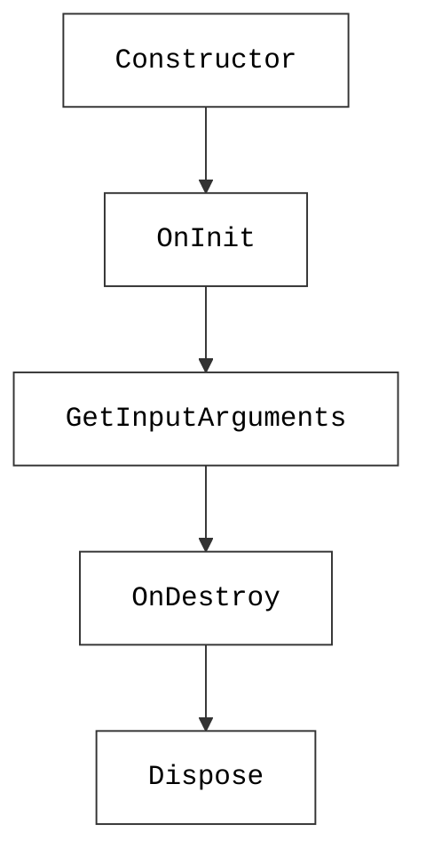
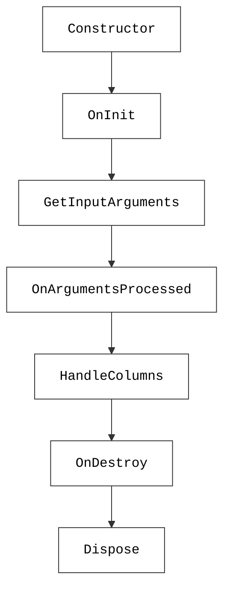
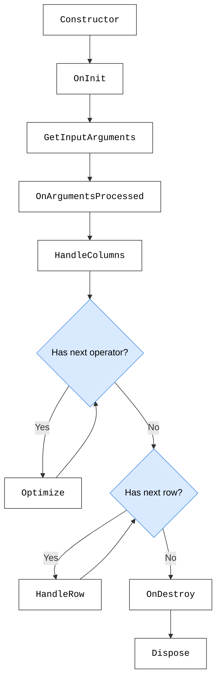

# Lifecycle of custom operators

Whenever a custom operator is used, an instance of the associated C# class is created, and GQI calls the [lifecycle methods](#lifecycle-methods) that are needed for the current query phase.

## When is a custom operator instance created?

A new custom operator instance is created **every time** GQI starts one of the following query phases:

- **[Argument discovery](#argument-discovery-lifecycle)**: Determines which query arguments can be configured for the custom operator.
- **[Column resolution](#column-resolution-lifecycle)**: Determines which columns are available without fetching any data.
- **[Query execution](#query-execution-lifecycle)**: Transforms the rows in the query result.

The diagrams below give an overview of the custom operator lifecycle in every query phase. Lifecycle methods are visualized in boxes and lifecycle conditions are visualized in blue diamonds. Click on the methods and conditions to get more details.

### Argument discovery lifecycle

### Column resolution lifecycle

### Query execution lifecycle

## Lifecycle methods

The following lifecycle methods exist for custom operators:

| Method | Interface | Required | Availability |
|--|--|--|--|
| [Constructor](#constructor) | None | No | Always |
| [OnInit](#oninit) | [IGQIOnInit](xref:GQI_IGQIOnInit) | No | From DataMiner 10.4.5/10.5.0 onwards<!-- RN 38959 --> |
| [GetInputArguments](#getinputarguments) | [IGQIInputArguments](xref:GQI_IGQIInputArguments) | No | Always |
| [OnArgumentsProcessed](#onargumentsprocessed) | [IGQIInputArguments](xref:GQI_IGQIInputArguments) | No | Always |
| [HandleColumns](#handlecolumns) | [IGQIColumnOperator](xref:GQI_IGQIColumnOperator) | No | Always |
| [Optimize](#optimize) | [IGQIOptimizableOperator](xref:GQI_IGQIOptimizableOperator) | No | Always |
| [HandleRow](#handlerow) | [IGQIRowOperator](xref:GQI_IGQIRowOperator) | No | Always |
| [OnDestroy](#ondestroy) | [IGQIOnDestroy](xref:GQI_IGQIOnDestroy) | No | From DataMiner 10.4.5/10.5.0 onwards<!-- RN 38959 --> |
| [Dispose](#dispose) | [IDisposable](https://learn.microsoft.com/dotnet/api/system.idisposable) | No | From DataMiner 10.5.0 [CU18]/10.6.0 [CU6]/10.6.9 onwards when using the [GQI DxM](xref:GQI_DxM).<!-- RN 45635 --> |

### Constructor

When a new custom operator instance is created, GQI first calls a constructor. Before DataMiner 10.5.0 [CU18]/10.6.0 [CU6]/10.6.9<!-- RN 45635 -->, this is always the public parameterless constructor. If the class does not explicitly declare a constructor, the default constructor is used.

From DataMiner 10.5.0 [CU18]/10.6.0 [CU6]/10.6.9 onwards<!-- RN 45635 -->, custom operators using the `Skyline.DataMiner.Core.GQI.Extensions` API and the GQI DxM can use [constructor injection](xref:GQI_Extensions_Services#injecting-services-into-an-extension). GQI still uses the public parameterless constructor when one exists. Otherwise, it resolves the constructor parameters before [OnInit](#oninit). If construction fails, no other lifecycle methods are called for that instance.

### OnInit

Building block interface: [IGQIOnInit](xref:GQI_IGQIOnInit)

If implemented, `OnInit` is always the first lifecycle method. It can provide references to dependencies like a logger or an SLNet connection, and it can be used to initialize resources that should be available during the lifetime of the custom operator instance.

> [!IMPORTANT]
> Resources that are successfully initialized here should be cleaned up in the [OnDestroy](#ondestroy) lifecycle method. For cleanup that must also happen when `OnInit` fails, implement [IDisposable](#dispose).

> [!NOTE]
> When resources are only required to determine the columns, the initialization should be done in the [HandleColumns](#handlecolumns) lifecycle method to avoid unnecessary resource allocations.

### GetInputArguments

Building block interface: [IGQIInputArguments](xref:GQI_IGQIInputArguments)

If implemented, the `GetInputArguments` method defines the arguments that can be used to configure the custom operator in a query.

Later, the arguments defined here will determine which argument values are available in the [OnArgumentsProcessed](#onargumentsprocessed) lifecycle method.

### OnArgumentsProcessed

Building block interface: [IGQIInputArguments](xref:GQI_IGQIInputArguments)

If implemented, the `OnArgumentsProcessed` method gives access to the values of the arguments defined in the [GetInputArguments](#getinputarguments) lifecycle method that were specified in the query.

### HandleColumns

Building block interface: [IGQIColumnOperator](xref:GQI_IGQIColumnOperator)

If implemented, the `HandleColumns` lifecycle method allows you to transform the query columns by:

- Adding new columns
- Renaming existing columns
- Removing existing columns

This method can also be used to just provide access to the currently available columns.

> [!IMPORTANT]
> Avoid the implicit use of query columns in your custom operator by retrieving them explicitly via [query arguments](xref:GQI_IGQIInputArguments). This both informs users which columns are relevant and prevents unintended side effects when the query is optimized.

### Optimize

Building block interface: [IGQIOptimizableOperator](xref:GQI_IGQIOptimizableOperator)

If implemented, the `Optimize` lifecycle method allows the custom operator to interpret downstream operators that are applied directly and makes it possible to adjust its behavior to improve query execution performance.

This lifecycle method may be called multiple times for the same instance when the custom operator removes or reorders other operators.

### HandleRow

Building block interface: [IGQIRowOperator](xref:GQI_IGQIRowOperator)

If implemented, the `HandleRow` lifecycle method defines how query rows will be transformed. It will be called exactly once for each row in the current query result, and for every row you can do any of the following:

- Get the row key
- Get or set the row metadata
- Get or set cell values and display values
- Remove the row from the query result

> [!NOTE]
> If the custom operator removed a column in the [HandleColumns](#handlecolumns) lifecycle method, you can still access the associated cell value here.

### OnDestroy

Building block interface: [IGQIOnDestroy](xref:GQI_IGQIOnDestroy)

If implemented, `OnDestroy` is called during cleanup when [OnInit](#oninit) completed successfully. It allows you to clean up resources that were used during the lifetime of the custom operator instance.

> [!IMPORTANT]
> The `OnDestroy` lifecycle method will **not** be called when the [OnInit](#oninit) lifecycle method failed. For cleanup that must happen regardless of the `OnInit` result, use [Dispose](#dispose). See also [Did an exception occur?](#did-an-exception-occur).

### Dispose

Building block interface: [IDisposable](https://learn.microsoft.com/dotnet/api/system.idisposable)

From DataMiner 10.5.0 [CU18]/10.6.0 [CU6]/10.6.9 onwards<!-- RN 45635 -->, when a custom operator using the `Skyline.DataMiner.Core.GQI.Extensions` API and the GQI DxM implements `IDisposable`, GQI calls `Dispose` when the instance is cleaned up. Use this to release resources that are tied to the instance lifetime.

> [!NOTE]
> Contrary to [OnDestroy](#ondestroy), `Dispose` is also called when [OnInit](#oninit) failed. See also [Did an exception occur?](#did-an-exception-occur).

## Lifecycle conditions

The lifecycle methods that are called on a custom operator instance depend on the conditions below.

### Which lifecycle interfaces are implemented?

Optional lifecycle methods are only called when the custom operator C# class implements the corresponding [building block interface](xref:CO_Building_blocks).

### Which query phase is running?

The phase for which the custom operator instance was [created](#when-is-a-custom-operator-instance-created) determines the lifecycle path. For example, argument discovery only needs argument definitions, while query execution continues until rows have been transformed.

### Are there operators to optimize?

Every time an optimizable operator is applied directly after a custom operator in a query, GQI can call [Optimize](#optimize) to allow the custom operator to interpret that operator.

### Are there rows to transform?

During query execution, GQI calls [HandleRow](#handlerow) once for every row in the current query result.

### Did an exception occur?

If an exception occurs during a lifecycle method, the lifecycle is interrupted and immediately moves to cleanup:

- [OnDestroy](#ondestroy) is always called if [OnInit](#oninit) did not fail.
- [Dispose](#dispose) is always called if the [constructor](#constructor) did not fail.
